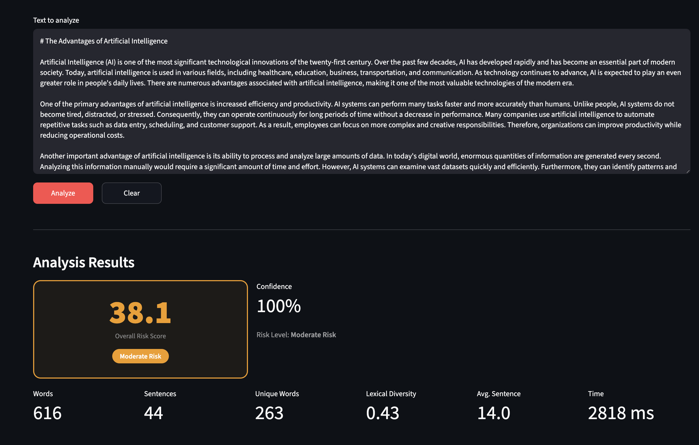
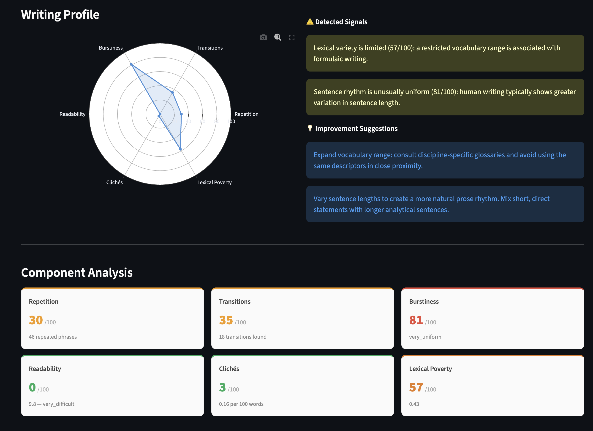
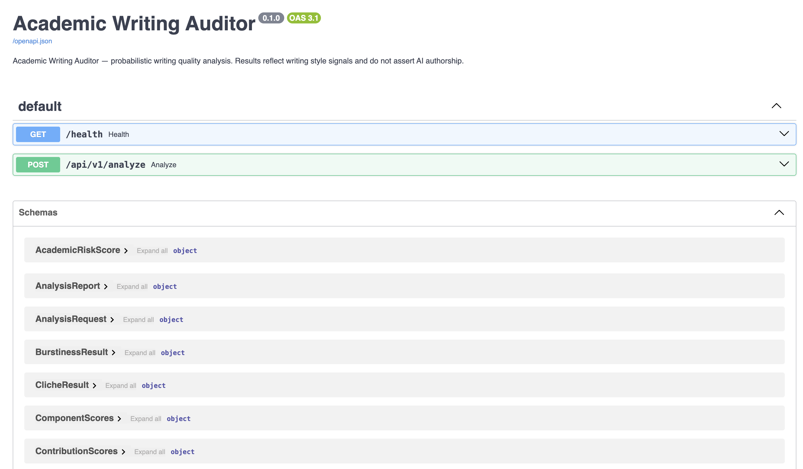
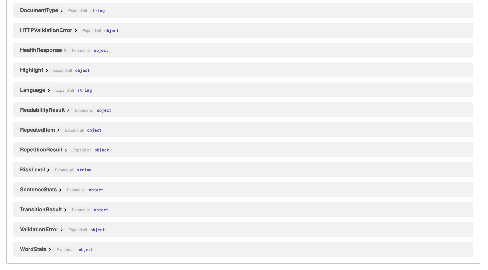

# Academic Writing Auditor

**A bilingual probabilistic writing quality analysis platform for English and Turkish.**

> This system does not claim AI authorship with certainty. It identifies evidence-based writing quality signals — patterns statistically associated with formulaic, repetitive, or low-variance prose — and produces a probabilistic risk score.

---

## Overview

Academic Writing Auditor analyzes submitted text across six independent linguistic dimensions and aggregates them into a composite **Academic Risk Score (0–100)**. The system is designed for academic integrity support, writing quality feedback, and NLP research into stylometric signals.

The platform is fully bilingual: language is either auto-detected or manually specified, and all analysis pipelines — tokenization, morphological analysis, lexical databases, and cliché corpora — operate natively in both English and Turkish.

---

## Screenshots

### Input Interface & Risk Score


*Text input panel with analysis results: overall risk score, confidence, word/sentence statistics.*

### Writing Profile & Component Analysis


*Six-axis radar chart visualizing the writing profile alongside individual component score cards.*

### REST API — Endpoints


*Auto-generated OpenAPI documentation via FastAPI. Exposes `GET /health` and `POST /api/v1/analyze`.*

### REST API — Schema Models


*Full Pydantic v2 schema catalog including `AcademicRiskScore`, `ComponentScores`, `ContributionScores`, and all analyzer result models.*

---

## Analysis Methodology

The system decomposes writing quality into six orthogonal signals. Each produces a normalized score in **[0, 100]** where higher values indicate stronger risk indicators.

### 1. Repetition Analysis

Detects over-used vocabulary via morphological stem grouping. Three sub-signals are combined:

- **Word signal** — stem types appearing above a frequency threshold, weighted by excess occurrence count
- **Phrase signal** — bigrams and trigrams with repeat occurrences, weighted by token coverage
- **Sentence-opener signal** — content words that begin multiple sentences

Stop words are excluded from all three sub-signals. English and Turkish stop word sets are maintained independently.

### 2. Transition Word Overuse

Scans the token sequence for known discourse connectors (English: *furthermore*, *moreover*, *therefore*, *however*, etc.; Turkish: *ayrıca*, *dolayısıyla*, *sonuç olarak*, etc.). Two sub-signals are combined:

- **Density signal** — total transition occurrences per sentence, capped at a saturation threshold
- **Repeat ratio** — proportion of detected transitions that appear more than once

High transition density with repeated identical connectors is a pattern associated with formulaic academic prose.

### 3. Burstiness (Sentence Rhythm)

Measures sentence-length variability using the **Burstiness Index**:

```
B = (σ − μ) / (σ + μ)
```

where σ is the population standard deviation and μ is the mean of per-sentence word counts. The normalized risk score is:

```
burstiness_score = (1 − B) / 2
```

This maps B = −1 (perfectly uniform) → 1.0 (maximum risk) and B = +1 (highly variable) → 0.0 (minimum risk). Human writing typically shows greater sentence-length variation than machine-generated text.

### 4. Readability

- **English**: Flesch Reading Ease (FRE) — `206.835 − 1.015 × ASL − 84.6 × SPW`
- **Turkish**: Turkish Readability Index (TRI) — `100 − 2.6 × ASL − 12.0 × max(0, SPW − 1.5)`, with syllables approximated by Turkish vowel counting

Unusually high readability for the declared document type contributes to the risk signal.

### 5. Cliché Detection

Matches a curated database of formulaic phrases (English: *in conclusion*, *it is important to note that*, *it goes without saying*, etc.; Turkish: *sonuç olarak*, *bilindiği üzere*, *büyük önem taşımaktadır*, etc.) against the token sequence using a sliding-window comparator. Score is normalized against a density saturation threshold.

### 6. Lexical Poverty

Computes the **Type-Token Ratio (TTR)** over morphologically reduced forms:

```
lexical_diversity = unique_stems / total_tokens
lexical_poverty   = (1 − lexical_diversity) × 100
```

Stemming/lemmatization ensures that inflectional variants of the same root count as a single type, giving a more accurate measure of true vocabulary breadth than surface-form counting.

---

## Composite Scoring Model

The six component scores are aggregated via a weighted sum:

```
overall_score = Σ weight_i × component_i
```

Default weight configuration:

| Component          | Weight |
| ------------------ | ------ |
| Repetition         | 0.25   |
| Transition overuse | 0.15   |
| Low burstiness     | 0.20   |
| Lexical poverty    | 0.15   |
| Cliché density    | 0.15   |
| Readability        | 0.10   |

**Risk tiers:**

| Score     | Tier           |
| --------- | -------------- |
| 0 – 30   | Low Risk       |
| 31 – 55  | Moderate Risk  |
| 56 – 75  | High Risk      |
| 76 – 100 | Very High Risk |

**Confidence** is estimated from word count and saturates at 1.0 for texts of 300 words or more.

The response also includes `contribution_scores` — the weighted contribution of each component to the final score — enabling transparent debugging of which signal is driving the verdict.

---

## Architecture

```
writing-analyzer/
├── src/
│   ├── api/            FastAPI application, routes, error handlers, DI wiring
│   ├── analyzers/      Six independent analyzer modules (one class per signal)
│   ├── models/         Pydantic v2 request/response models and enums
│   ├── scoring/        AcademicRiskScorer, ScoringWeights, contribution builder
│   ├── services/       AnalysisService orchestrator, TokenizerService, LanguageDetector
│   └── utils/
├── frontend/           Streamlit UI (app.py, components.py, api_client.py, translations.py)
├── tests/              Unit + integration test suite
├── benchmark/          Benchmark harness for human vs LLM text comparison
└── docs/               diagnostics.md, improvement_plan.md
```

**Tech stack:** Python 3.13 · FastAPI · Pydantic v2 · Streamlit · Plotly · NLTK (English tokenization + Porter Stemmer) · Zeyrek (Turkish morphological analysis) · textstat (Flesch formulas) · langdetect

**Design principles:** Clean Architecture, SOLID, dependency injection via `lru_cache` singleton, full type annotations, Ruff-enforced style.

---

## Quick Start

```bash
# 1. Create and activate virtual environment
python -m venv .venv && source .venv/bin/activate

# 2. Install dependencies
pip install -e ".[dev]"

# 3. Download NLTK data (first run only)
python -c "import nltk; nltk.download('punkt_tab')"

# 4. Start the API server
uvicorn src.api.app:app --reload --port 8000

# 5. In a second terminal, start the UI
streamlit run frontend/app.py
```

Interactive API documentation is available at `http://localhost:8000/docs`.

---

## API

| Method   | Endpoint            | Description                                                                        |
| -------- | ------------------- | ---------------------------------------------------------------------------------- |
| `GET`  | `/health`         | Liveness check. Returns `{"status": "ok", "version": "0.1.0"}`                   |
| `POST` | `/api/v1/analyze` | Full analysis. Accepts `text`, optional `document_type`, optional `language` |

**Request example:**

```json
{
  "text": "...",
  "document_type": "academic",
  "language": "en"
}
```

**Response** includes: `language`, `word_stats`, `sentence_stats`, `repetition`, `transitions`, `burstiness`, `readability`, `cliches`, `academic_risk` (with `component_scores`, `contribution_scores`, `explanations`), `highlights`, `suggestions`, `processing_time_ms`.

---

## Benchmark

A benchmark harness is included under `benchmark/` for systematic evaluation across human-written and LLM-generated text samples:

```bash
python benchmark/run_benchmark.py
```

Output: per-group statistics (mean, median, std), component discrimination analysis (human mean vs LLM mean per signal), and weighted contribution breakdown.

---

## License

MIT — see [LICENSE](LICENSE).
